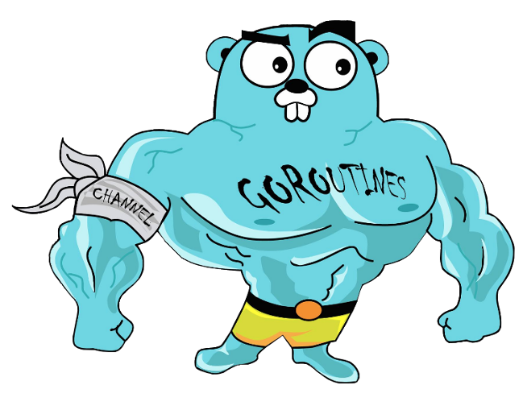

### Hi there 👋

<!--
**fengyuan-liang/fengyuan-liang is special_ ✨ repository because its `README.md` (this file) appears on your GitHub profile.
-->

Here are some quick things about me:

- 🔭 I'm just a rookie in here.
- 📫 The best way to reach me is sending me an email -> <liangfengyuan1024@gmail.com>.
- ⚡ Coding is my passion.

